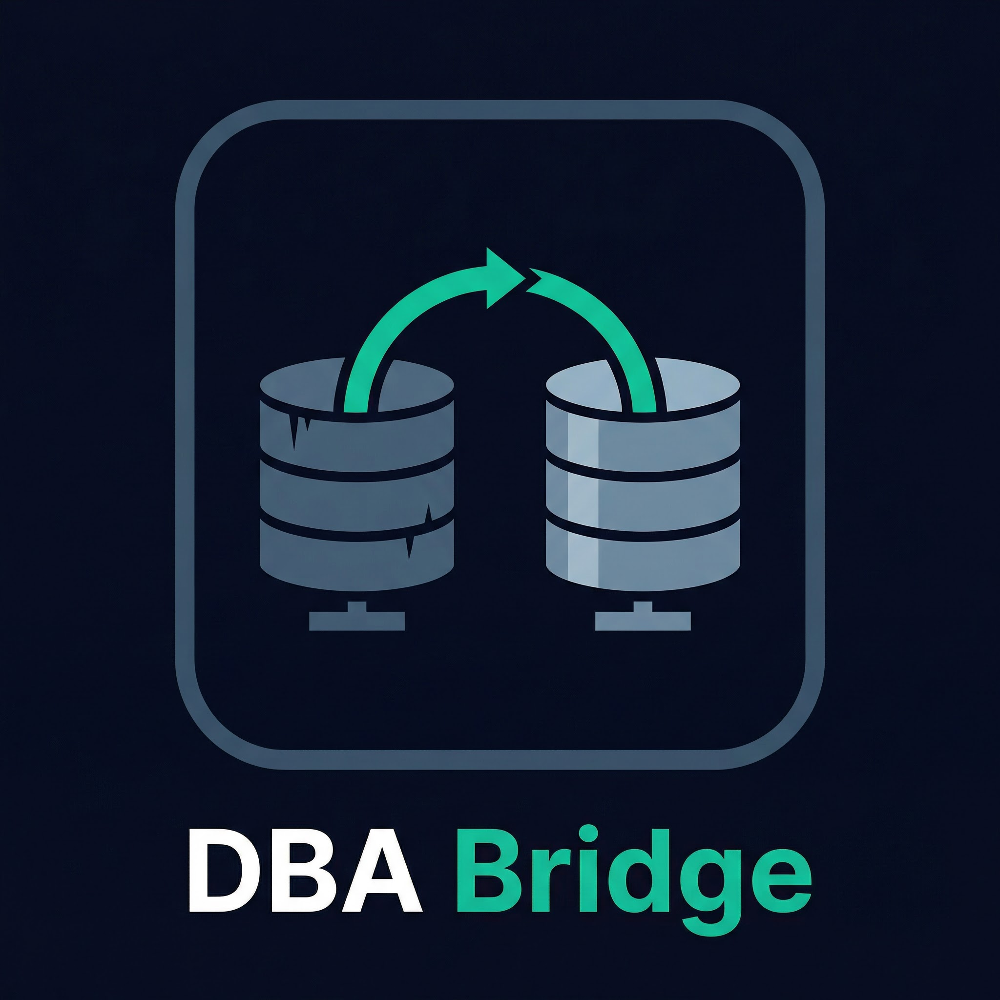

<p align="center">
  
</p>

<p align="center">
  <strong>Know exactly what will break before you migrate.</strong>
</p>

<p align="center">
  <a href="https://dbabridge.com">Website</a> ·
  <a href="mailto:info@ai2innovate.io">Email</a> ·
  <a href="https://ai2innovate.io">AI2Innovate</a>
</p>

---

# DBA Bridge

> Know exactly what will break before you migrate.

**DBA Bridge** is a free, open source desktop application for database migration.  
It scans your legacy database and produces a detailed audit report of every incompatibility, risky stored procedure, data type mismatch, and foreign key issue — **before you touch production.**

Download it. Open it. Connect your database. Get a report in minutes.  
No cloud account. No command line. No configuration files. Works like DBeaver.

---

## Download

| Platform | Download |
|----------|----------|
| macOS (Apple Silicon + Intel) | [DBABridge-mac-universal.dmg](#) *(coming soon)* |
| Windows | [DBABridge-windows-setup.exe](#) *(coming soon)* |
| Linux | [DBABridge-linux.AppImage](#) *(coming soon)* |

> Join the early access waitlist at [dbabridge.com](https://dbabridge.com) to be notified at launch.

---

## The Problem

Every major migration tool — AWS DMS, Azure Migrate, ora2pg — reports success based on row counts.  
They don't check stored procedures. They don't flag data type edge cases. They don't handle FK constraint ordering.  
Your app breaks after cutover. There is no report. No explanation. No evidence pack. Just a log file and a missed deadline.

**DBA Bridge fixes this.**

---

## What It Does

### 1. Pre-Migration Audit Report

Connect DBA Bridge to your source database (read-only — nothing is modified).  
It scans every table, column, stored procedure, trigger, index, sequence, and constraint.  
Outputs a structured HTML or PDF report you can hand to your team before migration starts.

**The report tells you:**
- Which stored procedures are clean, which need rewriting, which have no equivalent
- Every column with a risky data type conversion (Oracle `DATE` → `TIMESTAMP`, `NUMBER` precision loss, `NVARCHAR` collation differences)
- The correct table migration order based on foreign key dependencies
- Circular FK dependencies and how to resolve them
- Overall risk score: **Low / Medium / High / Critical**
- Estimated migration time per table

---

### 2. Stored Procedure Rewriter

DBA Bridge automatically rewrites Oracle PL/SQL and SQL Server T-SQL to Postgres PL/pgSQL.  
Shows a **side-by-side diff** with a confidence score per line.  
You review and approve every change before anything is applied.

Runs locally on your machine using [Ollama](https://ollama.com) — your code never leaves your network.  
Optional: connect to [multimind.dev](https://multimind.dev) cloud AI for faster processing on large procedure sets.

**Supported rewrites:**

| Oracle / SQL Server | Postgres |
|---------------------|---------|
| Oracle `PL/SQL` | `PL/pgSQL` |
| SQL Server `T-SQL` | `PL/pgSQL` |
| `ROWNUM` | `LIMIT / OFFSET` |
| `NVL()` | `COALESCE()` |
| `DECODE()` | `CASE WHEN` |
| `CONNECT BY` (hierarchical queries) | Recursive CTEs |
| Oracle `DUAL` table references | Removed / rewritten |
| SQL Server `TOP` | `LIMIT` |
| Oracle `SEQUENCE` | `SERIAL` / `GENERATED ALWAYS AS IDENTITY` |
| `ISNULL()` | `COALESCE()` |
| `MINUS` | `EXCEPT` |

---

### 3. Post-Migration Validation Report

After migration completes, DBA Bridge compares source and target automatically.

**Checks performed:**
- Row counts per table (source vs target must match)
- Null distribution per column
- All FK, PK, and UNIQUE constraints enabled and valid
- All indexes recreated
- Stored procedure count matches
- Sequence values at correct next position
- Sample queries run against both databases — results are diffed

**Output:**
- Per-table status: 🟢 Green / 🟡 Amber / 🔴 Red
- Summary: *"Migration is 94% validated. 3 issues found. 2 are warnings, 1 requires action."*
- Specific actionable errors with root cause explanation

---

## Supported Migration Pairs

| Source | Target | Status |
|--------|--------|--------|
| Oracle | PostgreSQL | ✅ Phase 1 |
| SQL Server | Supabase | ✅ Phase 1 |
| MySQL / MariaDB | PostgreSQL | 🔜 Phase 2 |
| MongoDB | PostgreSQL | 🔜 Phase 3 |
| DynamoDB | PostgreSQL / Supabase | 🔜 Phase 3 |
| Any relational | Snowflake / BigQuery | 🔜 Phase 3 |

---

## How It Works

**1. Connect your source database**  
Enter your connection details. DBA Bridge connects read-only — it cannot modify your source database.

**2. Run the Audit**  
Click "Run Audit." DBA Bridge scans the entire schema and generates your pre-migration report in minutes.

**3. Review stored procedure rewrites**  
For each stored procedure, see the original and rewritten version side by side. Approve, edit, or skip each one.

**4. Configure and run the migration**  
Select which tables to migrate, set batch sizes, choose migration order (or use the recommended order from the FK graph). Click Run.

**5. Review the Validation Report**  
After migration, run validation. Get a traffic-light report proving every table migrated correctly.

---

## App Screens

```
┌─────────────────────────────────────────┐
│  DBA Bridge                             │
│                                         │
│  [1] Connect Source Database            │
│  [2] Connect Target Database            │
│  [3] Run Pre-Migration Audit    ← start │
│  [4] Review Procedure Rewrites          │
│  [5] Configure Migration                │
│  [6] Run Migration                      │
│  [7] View Validation Report             │
└─────────────────────────────────────────┘
```

---

## AI Options

DBA Bridge uses local AI for stored procedure rewriting. You choose how it runs:

| Option | Setup | Privacy |
|--------|-------|---------|
| **Ollama (local)** | Install [Ollama](https://ollama.com), pull `deepseek-coder` | Code never leaves your machine |
| **multimind.dev (cloud)** | Enter API key in settings — no Ollama needed | Processed on managed infrastructure |

The free tier uses Ollama only. Cloud AI is available on the paid plan.

---

## Tech Stack

| Layer | Technology |
|-------|-----------|
| Desktop app | [Tauri](https://tauri.app) (Rust + React) |
| Core engine | Python 3.11 |
| Database connections | SQLAlchemy, cx_Oracle, psycopg2, pyodbc, pymysql |
| Schema graph | NetworkX |
| Local AI | Ollama (deepseek-coder, llama3, codellama) |
| Cloud AI | [multimind.dev](https://multimind.dev) |
| Build / packaging | GitHub Actions — auto-builds Mac / Windows / Linux on every release tag |

---

## Comparison

| Tool | Audit Report | Proc Rewrite | Validation | Desktop App | Open Source |
|------|:---:|:---:|:---:|:---:|:---:|
| AWS DMS | ❌ | ❌ | ❌ | ❌ | ❌ |
| Azure Migrate | ❌ | ❌ | ❌ | ❌ | ❌ |
| ora2pg | ❌ | Partial | ❌ | ❌ | ✅ |
| pgloader | ❌ | ❌ | ❌ | ❌ | ✅ |
| Ispirer | Partial | Partial | ❌ | ✅ | ❌ |
| **DBA Bridge** | ✅ | ✅ | ✅ | ✅ | ✅ |

---

## Pricing

| Tier | Price | What's included |
|------|-------|----------------|
| **Open Source** | Free | Desktop app, all migration pairs, local Ollama AI, audit + validation reports |
| **Cloud AI** | $29/month | Everything above + multimind.dev cloud AI, no Ollama install required |
| **Enterprise** | $299/month | Everything + team collaboration, self-hosted option, compliance reports, SLA |

The core tool is free and open source. Forever.

---

## Current Status

**Early development — not yet ready for production use.**

- [x] Architecture and planning complete
- [x] Full roadmap finalised
- [ ] Schema introspection engine (Oracle + SQL Server)
- [ ] Data type mapping engine
- [ ] FK dependency graph
- [ ] Pre-migration audit report generator
- [ ] Stored procedure rewriter (Ollama integration)
- [ ] Data migration engine
- [ ] Post-migration validation report
- [ ] Tauri desktop app — all screens wired
- [ ] GitHub Actions release pipeline (Mac / Windows / Linux builds)
- [ ] Public beta

⭐ Star the repo to follow progress.  
📧 Join the waitlist at [dbabridge.com](https://dbabridge.com) for early access.

---

## Contributing

The best contributions right now:

- **Share what broke in your migration** — open an issue describing what failed in your Oracle/SQL Server → Postgres migration. Real edge cases make the audit engine significantly better.
- **Share an anonymised schema dump** — even a small schema with stored procedures helps validate the rewriter. Open an issue or email us at info@ai2innovate.io.
- **Watch for the connector SDK** — want a database pair not listed above? The connector SDK ships in Phase 3. Watch this repo.

See [CONTRIBUTING.md](./CONTRIBUTING.md) before opening a PR.

---

## Links

| | |
|-|-|
| Website | [dbabridge.com](https://dbabridge.com) |
| Company | [AI2Innovate](https://ai2innovate.io) |
| Email | info@ai2innovate.io |

---

## License

Apache 2.0 — see [LICENSE](./LICENSE)

---

*Built by [AI2Innovate](https://ai2innovate.io) — enterprise-ready software for complex infrastructure challenges.*  
*Built because  DMS said the migration succeeded. The app broke anyway.*
